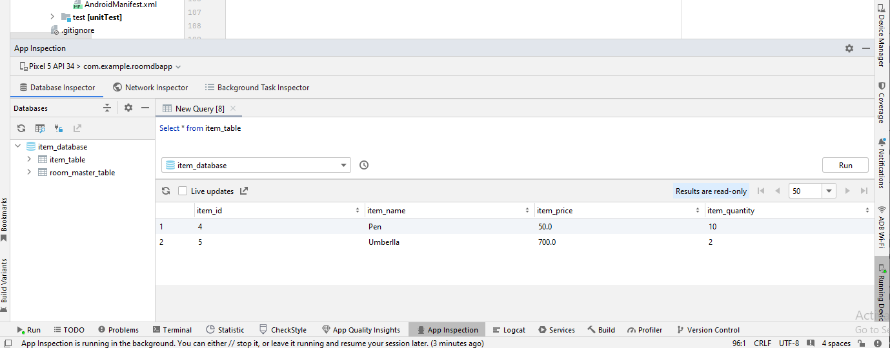

# 1. Add Dependency
### 1. Add dependency for room database in app level build.gradle.kts
> **Reference URL -** [Room Database Document](https://developer.android.com/jetpack/androidx/releases/room)
```
dependencies {
// Room Database
val room_version = "2.6.1"
implementation("androidx.room:room-runtime:$room_version")
// optional - Kotlin Extensions and Coroutines support for Room
implementation("androidx.room:room-ktx:$room_version")
}
```

### 2. Add kapt plugin in app level build.gradle.kts
```
  plugins {
    id("kotlin-kapt")
  }
```

### 3. Add kapt plugin in project level build.gradle.kts
> **Reference URL -** [kapt document](https://kotlinlang.org/docs/kapt.html)
```
    plugins {
        kotlin("kapt") version "2.0.20"
    }
 ```

### 4. Add dependency for kotlin annotation Processing tool in app level build.gradle.kts
```
    dependencies {
        // To use Kotlin annotation processing tool (kapt)
        kapt("androidx.room:room-compiler:$room_version")
    }     
```

### 5. Add Kotlin Coroutines support
> **Reference URL -** [Kotlin coroutines](https://developer.android.com/kotlin/coroutines)
```
    dependencies {
        // Add Coroutines dependency
        implementation("org.jetbrains.kotlinx:kotlinx-coroutines-android:1.7.3")
    }
```

### 6. Add dependency for room database coroutine in app level build.gradle.kts
> **Reference URL -** [Room Database Document](https://developer.android.com/jetpack/androidx/releases/room)
```
    dependencies {
        // optional - Kotlin Extensions and Coroutines support for Room
        implementation("androidx.room:room-ktx:$room_version")
    }
```

### 7. Add dependency for ViewModel, LiveData and Annotation processor in app level build.gradle.kts
> **Reference URL -** [Lifecycle Document](https://developer.android.com/jetpack/androidx/releases/lifecycle)
```
    dependencies {
        /* LifeCycle */
        val lifecycle_version = "2.8.5"
        // ViewModel
        implementation("androidx.lifecycle:lifecycle-viewmodel-ktx:$lifecycle_version")
        // LiveData
        implementation("androidx.lifecycle:lifecycle-livedata-ktx:$lifecycle_version")
        // Annotation processor
        kapt("androidx.lifecycle:lifecycle-compiler:$lifecycle_version")
    }
```

# 2. There are Three main parts to implement the room Database

### 1. Entity(table)- Data class
``` 
    Represent table's in your app's database. We use them to update
    the data storedin rows for insertion
    
    Table Name :- item_table 
    Entity Class Name :- Item
    
    Entity fields :-  
        1. item_id 
        2. item_name
        3. item_price
        4. item_quantity 
``` 
- **i. Create Item.kt (Kotlin Data Class)**

### 2. DAO(Database Access Object) - Interface
```
    It makes queries on the Entity using API. It provides methods that
     our app uses to retrieve.update, insert, and delete data in the database.
```
- **i. Create ItemDao.kt (Kotlin Interface)**

### 3. Data Base - Abstract class or Singleton
```
    Is the Database class that provides your app with instances of
     the DAO's associated with the database.
```
- **i.  Create ItemDatabase.kt (kotlin abstract Class)**


# 3. Inspect Database from Android Studio while running the applicaton.
````
    Go to View -> Tool Windows -> App Inspection
    We can see the Database details from the App Inspection Section
    We can just Tick the Live update or add Query in the New Query section.
    
````


[//]: # (![img_1.png]&#40;img_1.png&#41;)


